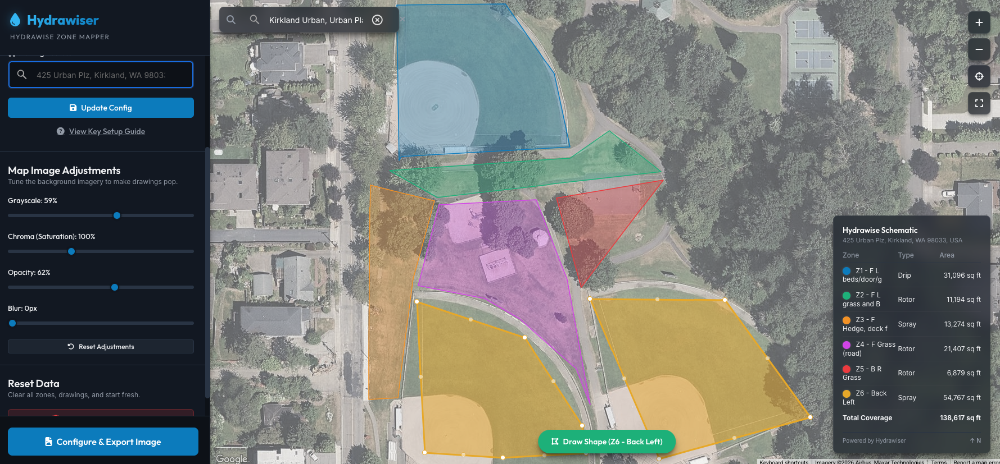
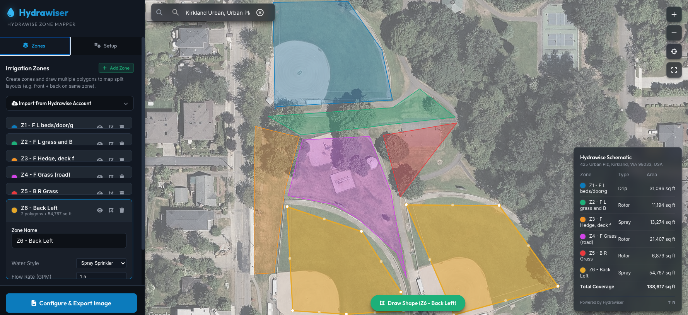
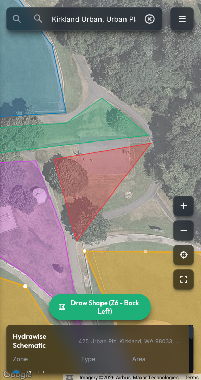

# Hydrawise Zone Mapper

Hydrawise Zone Mapper is a client-side web application designed to help homeowners and irrigation technicians generate custom, high-resolution aerial blueprints for smart sprinkler systems. 

Because many properties feature split-irrigation zones (such as a single zone controlling both a front and back lawn strip, or micro-drips spanning non-contiguous beds), this application allows you to group multiple, distinct polygons under a single, styled zone container. 

---

## App Previews

| Desktop Dashboard | Export Preview | Mobile Version |
| :---: | :---: | :---: |
|  |  |  |

---

## Key Features

- **Multi-Polygon Grouping:** Draw and link several disconnected shapes to a single irrigation zone.
- **Dynamic Area Calculation:** Real-time square footage (or square meter) calculations using the Google Maps Spherical Geometry library. Computations update instantly as you edit polygon vertices.
- **Persistent Data:** Auto-saves your Google Maps configuration, Hydrawise Developer credentials, active controllers, zones, and mapped coordinate shapes directly in your browser's `localStorage` so you never lose your progress.
- **Watering Presets:** Configure sprinkler details (Rotor, Spray, Drip, Micro-Spray, Mainline, Lateral) with color-coded overlays matching standard irrigation design practices.
- **Address Autocomplete:** Jump immediately to your property using Google Places geocoding autocomplete.
- **Hydrawise Account Sync:**
  - Connects securely using your Developer API Key (no password requested or stored).
  - Supports multi-controller accounts with a dropdown selector for the active controller.
  - Automatically parses your relays, prefixing relay indices (e.g. `Z1 - Front Lawn`), and auto-assigns color presets and default GPM flow rates based on text keyword matches (e.g., "drip" -> Drip Orange, "lawn" -> Rotor Blue).
  - Handles browser CORS restrictions on localhost with a simple copy-paste JSON fallback wizard.
- **Map Visual Adjustments:** Real-time visual adjustment sliders (Grayscale, Saturation/Chroma, Opacity, Blur) applied specifically to the background map tiles to make drawn overlays and blueprint markings pop.
- **Enhanced Map Zoom & Navigation Controls:** Custom glassmorphic navigation panel featuring Zoom In, Zoom Out, Recenter, and Zoom-to-Fit-All-Shapes (calculates boundaries and fits all drawn polygons in the viewport), plus global hotkeys (+/- keys) and native scroll-wheel/trackpad-pinch support.
- **Dual Export Options:**
  - **Static Map Render (Recommended):** An offscreen canvas compositing system that requests clean tiles directly from Google's Maps Static API and stitches your polygons, a customized title block, a vector legend table, and an engineering north arrow into a professional blueprint. (Bypasses all standard browser canvas CORS taint bugs!).
  - **Screen Capture:** Direct web layout snapshot via `html2canvas` for quick reference.

---

## Quick Start (How to Run)

1. Clone or download this project directory.
2. Open `index.html` directly in any modern web browser, or serve it via a local development server:
   ```bash
   # Using python
   python3 -m http.server 8000
   
   # Or using node
   npx serve .
   ```
3. Enter your **Google Maps API Key** when prompted. The application will securely save the key in `localStorage` and initialize the canvas.

---

## Configuring the Google Cloud Console

To load interactive satellite maps, perform searches, and export high-resolution drawings, you need a Google Cloud API key with billing enabled.

### 1. Retrieve your API Key
1. Go to the [Google Cloud Credentials Console](https://console.cloud.google.com/apis/credentials).
2. Click **Create Credentials** at the top of the screen and select **API Key**.
3. Copy the key and paste it into the application's configuration screen.

### 2. Enable Required APIs
Go to the [Google API Library Console](https://console.cloud.google.com/apis/library) and ensure the following three libraries are set to **Enabled**:
- **Maps JavaScript API:** Renders the interactive map canvas and powers the Drawing Library.
- **Places API:** Translates your searches into coordinates and populates address autocomplete recommendations.
- **Maps Static API:** Processes coordinates and generates pristine, high-res composite downloads.

### 3. Link a Billing Account
Google requires a billing account to authenticate maps loading. Google provides a **$200 monthly free credit**, which covers thousands of map loads and static image requests—more than enough for personal configurations. Check status in the [Billing Console](https://console.cloud.google.com/billing).
